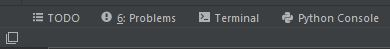
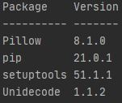

# SirRunner's Modding Tools

### Requirements
Python 3.8
 - Map Validator and Terrain Detailer
   - Pillow Module
 - History File Creator
   - Unidecode Module
   
All of the required Python modules are in requirements.txt.

### Installation
1. Download the repository via Code -> Download ZIP
2. I personally prefer using [PyCharm](https://www.jetbrains.com/pycharm/download/), and will be using that for the rest
   of the installation instructions
3. Extract the zip file that you downloaded (doesn't really matter where)
4. Move the contents of the unzipped file into your project directory. By default, the directory is 
   `C:\Users\USERNAME\PyCharmProjects\PROJECTNAME`
5. In the lower left corner you should see something like this:
     
   If you don't see that, and only the square in the corner, click the square
6. Click on the Terminal button, type `pip install -r requirements.txt` and hit enter
7. After it's done type `pip list` and hit enter. The results should be something like this:
   
   
### Contents
Current:
 - Terrain Detailer
  - Perlin Noise Detailer
  - Simple Random Choice Detailer

In Progress:
 - History File Generator
 - Map Validator
 - Map Localisation Generator
 - Adjacencies Generator